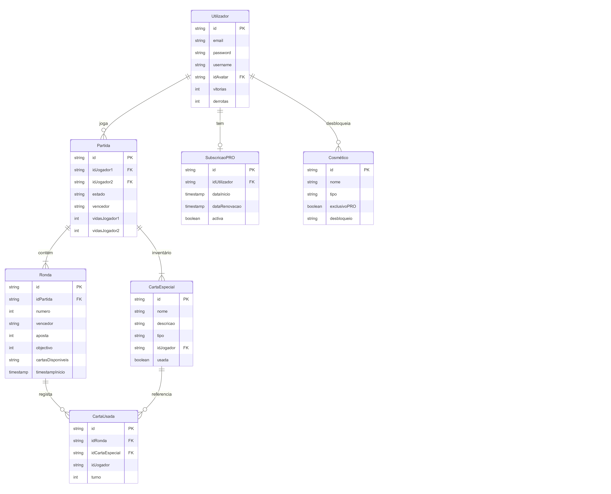
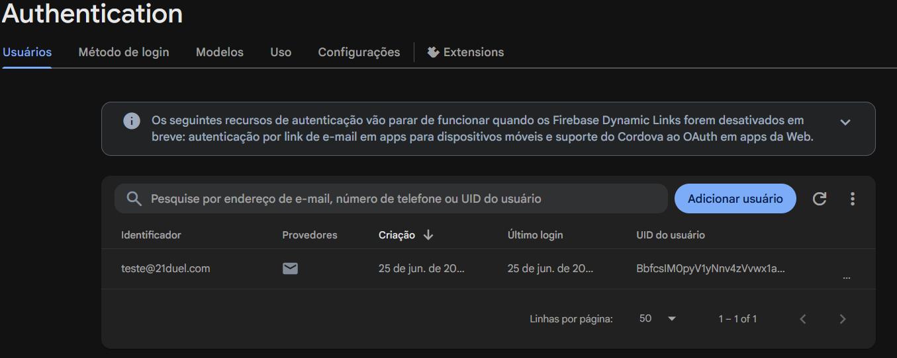
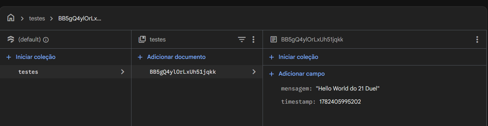
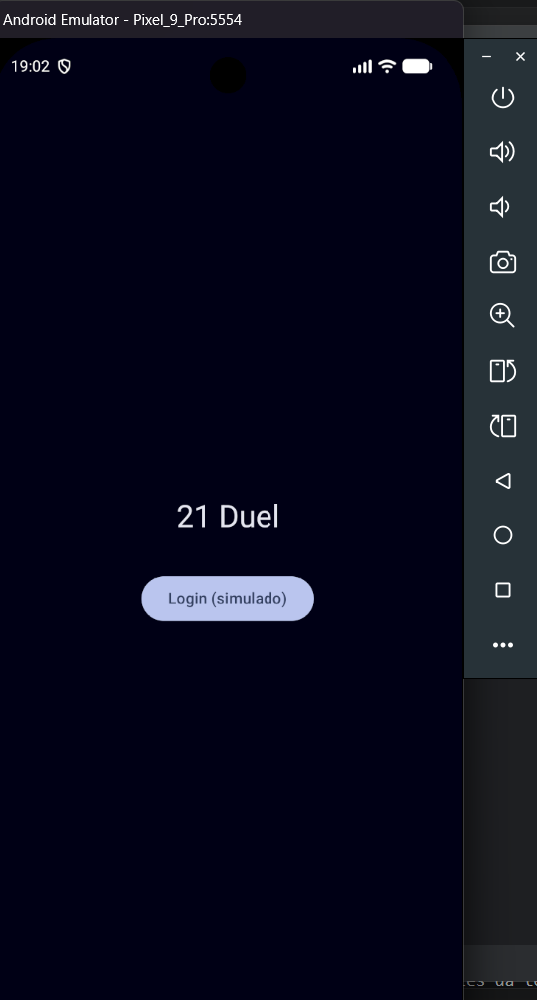
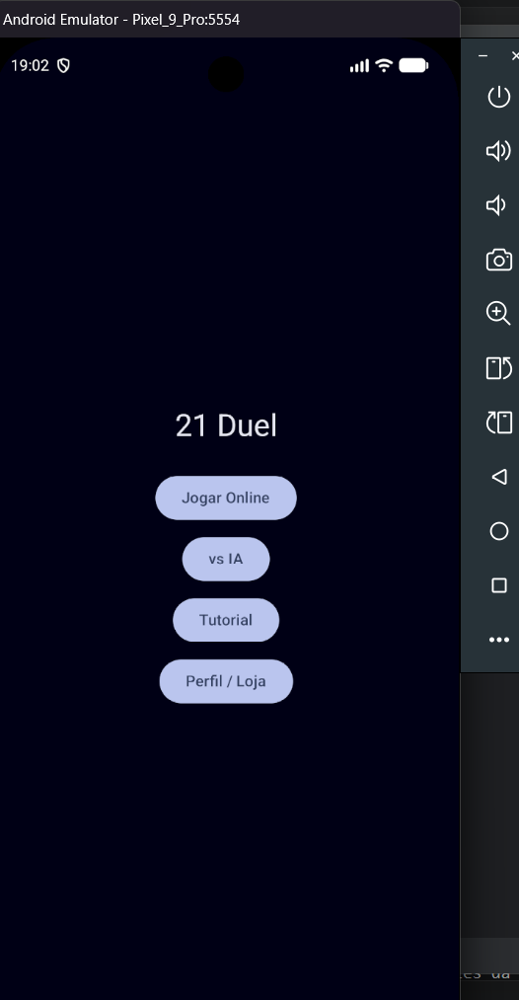
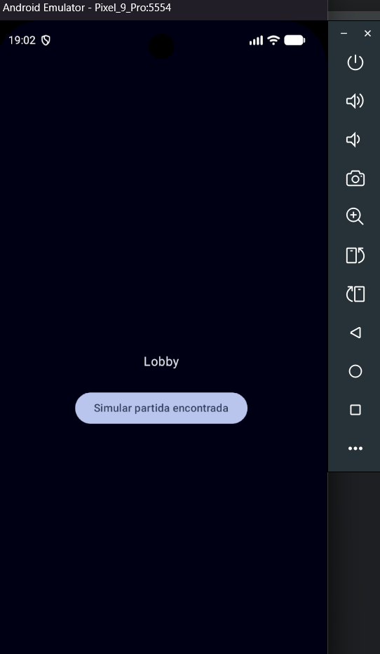
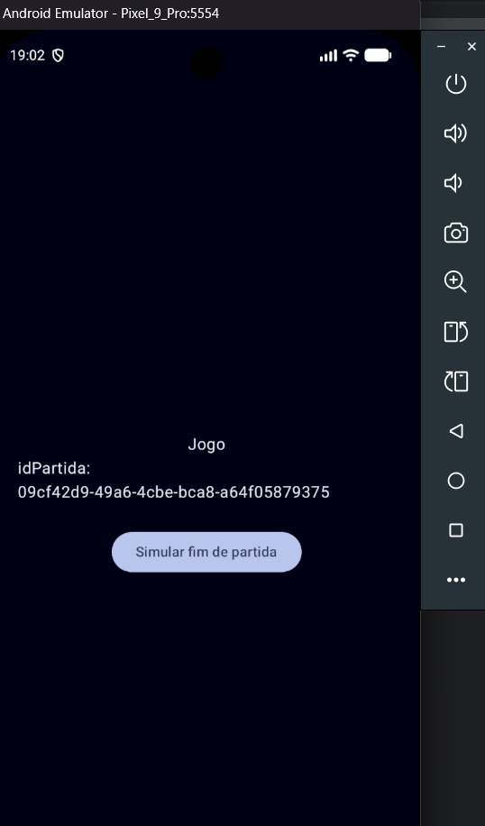
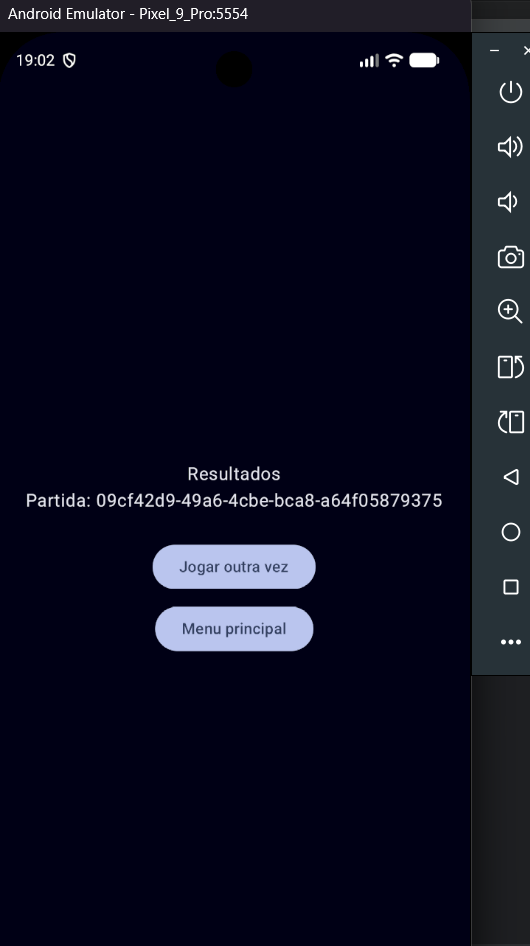
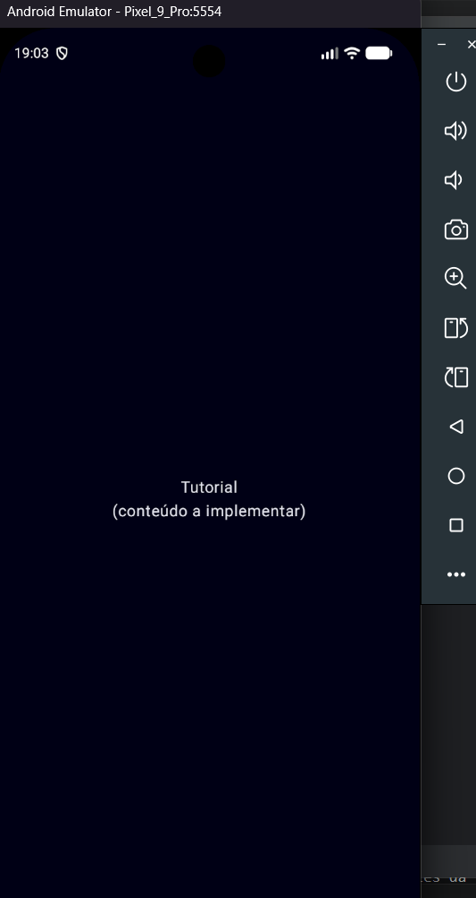
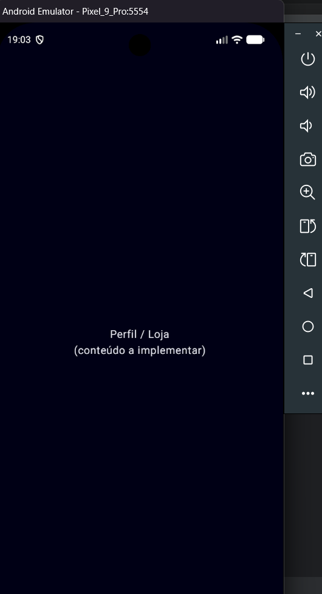

# Relatório — Fase de Pre-production
## 21 Duel

**Unidade Curricular:** Computação Móvel  
**Instituição:** Escola Náutica Infante D. Henrique  
**Data:** Junho 2026

---

## 1. Introdução

Este relatório documenta o trabalho realizado na fase de Pre-production do projecto **21 Duel**, um jogo de cartas 1v1 para Android. A fase teve como objectivos detalhar o design da aplicação (ADD), validar a ligação ao Firebase, e construir um protótipo mínimo de navegação entre todos os ecrãs principais.

Os documentos produzidos na fase anterior (Concept) — ACD, wireframes/mockups, mapa de navegação e diagrama E-A simplificado — servem de base a este trabalho e são referenciados ao longo deste relatório.

---

## 2. Application Design Document (ADD)

O ADD foi desenvolvido na íntegra nesta fase, cobrindo:

- Arquitectura geral da aplicação — padrão **MVVM**, com **Jetpack Compose** para a interface
- Estrutura de packages Kotlin
- Fluxo detalhado de interacção para cada um dos 7 ecrãs principais
- Modelo de dados em Kotlin, mapeando directamente o diagrama E-A
- Motor de jogo (lógica de pontuação, decisão de vencedor de ronda, comportamento da IA)
- Navegação entre ecrãs via Navigation Compose

O documento completo encontra-se em apêndice (`ADD_21Duel.md`) e em `/docs/pre-production/ADD_21Duel.md`.

### 2.1 Perfis de Utilizador

Foram definidas 3 personas que representam o público-alvo da aplicação:

- **O Casual** — jogador ocasional, prefere partidas rápidas, joga sobretudo contra IA
- **O Competitivo** — fã de jogos de cartas digitais, joga online, candidato a subscrição PRO
- **O Social** — joga com amigos em salas privadas, despreocupado com ranking

> Nota: reconhece-se que um utilizador real pode combinar características de várias personas — a sobreposição Competitivo + Social é identificada como o perfil mais provável de converter para a subscrição paga.

Descrição completa em `ACD_21Duel.md`, secção 2.

### 2.2 Diagrama Entidade-Associação Completo

Foi desenvolvido o diagrama E-A completo, com atributos para todas as 7 entidades identificadas na fase Concept (Utilizador, Partida, Ronda, CartaEspecial, CartaUsada, Cosmético, SubscriçãoPRO).



---

## 3. Teste de Ligação ao Firebase

Foi implementado e validado um teste mínimo de ligação entre a aplicação Android e o Firebase, conforme exigido pelo enunciado do projecto.

### 3.1 Configuração
- **Authentication:** Email/Password activado
- **Firestore Database:** modo de teste, localização `eur3 (europe-west)`

### 3.2 Resultado do Teste

Sequência testada: criação de conta → login → escrita de documento no Firestore → leitura do documento.

```
FirebaseTeste  D  Conta criada com sucesso
FirebaseTeste  D  Login feito com sucesso. UID: BbfcsIM0pyV1yNnv4zVvwx1aMf72
FirebaseTeste  D  Documento guardado com ID: BB5gQ4ylOrLxUh51jqkk
FirebaseTeste  D  Lido: {mensagem=Hello World do 21 Duel, timestamp=1782405995202}
```






## 4. Protótipo de Navegação

Foi construído um protótipo mínimo e funcional, cobrindo a navegação entre todos os 7 ecrãs principais da aplicação, usando Jetpack Compose e Navigation Compose. Os dados de cada ecrã são, por agora, simulados (hardcoded ou gerados localmente), sem ligação ainda à lógica real de jogo ou ao Firebase.

### 4.1 Ecrãs Implementados

| Ecrã | Estado no Protótipo |
|---|---|
| Login | Botão simulado avança directamente (sem autenticação real) |
| Menu Principal | 4 botões funcionais — Jogar Online, vs IA, Tutorial, Perfil |
| Lobby | Botão simula "encontrar partida", gera `idPartida` aleatório |
| Jogo | Mostra o `idPartida` recebido por navegação, botão simula fim de partida |
| Resultados | Mostra `idPartida`, botões para jogar outra vez ou voltar ao menu |
| Perfil / Loja | Placeholder, sem conteúdo funcional ainda |
| Tutorial | Placeholder, sem conteúdo funcional ainda |

### 4.2 Validação

Confirmou-se que a navegação entre todos os ecrãs funciona correctamente e que os dados (`idPartida`) passam correctamente entre ecrãs através das rotas do Navigation Compose.










### 4.3 Melhorias Identificadas para a Produção
- Adicionar botão de navegação "voltar" explícito nos ecrãs Tutorial e Perfil (actualmente depende-se do botão/gesto de voltar do sistema Android)

---

## 5. Avaliação de Conceito (substitui testes formais com utilizadores)

Em vez de testes formais com 4 utilizadores externos nesta fase, optou-se por uma avaliação crítica do conceito conduzida em conjunto com apoio de IA (Claude), reflectindo sobre pontos fortes e potenciais dificuldades de adopção:

**Pontos fortes identificados:**
- Conceito simples de explicar — "chegar a 21 antes do oponente"
- Sistema de vidas + apostas crescentes dá tensão sem complexidade excessiva
- Variedade de cartas especiais sem serem excessivas

**Riscos identificados e mitigações aplicadas:**
- 24 cartas especiais podiam ser intimidantes para um jogador novo → mitigado com tooltip (long press) que explica cada carta sem necessidade de decorar regras
- Falta de clareza sobre o comportamento da IA → definido comportamento simples e previsível (pede carta se pontuação ≤ objectivo − 3, joga 1 carta especial aleatória por ronda)
- Visibilidade do modo vs IA → já presente como botão de destaque no Menu Principal

---

## 6. Conclusão

A fase de Pre-production cumpriu os objectivos definidos: o design da aplicação foi detalhado no ADD, a ligação ao Firebase foi validada, e um protótipo de navegação funcional demonstra a viabilidade da estrutura de ecrãs definida na fase Concept.

Os principais itens transitados para a fase de Produção são:
- Implementação da lógica de jogo real (motor de jogo já desenhado no ADD)
- Implementação individual das 24 cartas especiais
- Ligação real da navegação aos dados do Firebase (substituindo os dados simulados do protótipo)
- Teste de imagens no Firebase Storage (em falta)
- Multilíngue, sistema de ranking e níveis/XP (itens na lista de detalhes por definir do ACD)

---

## Apêndices

- `ACD_21Duel.md` — Application Concept Document
- `ADD_21Duel.md` — Application Design Document
- `firebase_test.md` — Registo do teste de ligação ao Firebase
- Wireframes/mockups (Figma) — `/docs/concept/wireframes/`
- Diagrama de navegação — `/docs/concept/navigation_map.png`
- Diagrama E-A simplificado — `/docs/concept/entity_diagram.png`
- Diagrama E-A completo — `/docs/concept/entity_diagram_full.png`
